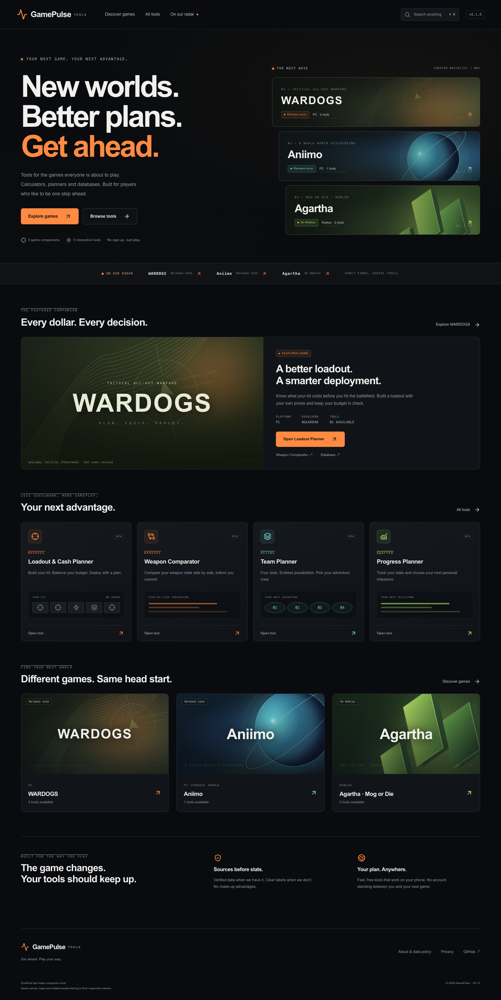

> **Current release: v0.2.1.** The image-based workspace, sourced catalog, click-to-equip builders, comparison charts and saved toolkit replace the v0.1 interface. See [v0.2 media/data notes](docs/MEDIA-v0.2.md) and [release verification](docs/verification/v0.2.0/browser-results.json).

# GamePulse Tools · v0.1.0

**Discover rising games early. Build the tools players actually need.**

[Open the website](https://jasonwaker.github.io/gamepulse-tools/) · [Release notes](https://github.com/JasonWaker/gamepulse-tools/releases) · [中文交付说明](docs/DELIVERY.zh-CN.md)

An independent, English-language game companion network for WARDOGS, Aniimo and Agartha Mog or Die. Original game-genre atmospheres, five interactive tools, source-aware records and a reusable static Next.js architecture.



## Run locally

Requires Node.js 22+.

```sh
npm ci
npm run dev
```

Open `http://localhost:3000`. The default local base path is empty. Use `.env.example` as a reference; for root-path local development leave `NEXT_PUBLIC_BASE_PATH` empty.

```sh
npm run lint
npm run typecheck
npm test
npm run build
npm run preview
```

Production export is in `out/`. `npm test` checks calculation edge cases and executes the Supabase-compatible schema in an embedded PostgreSQL engine, including anonymous RLS access tests. Browser checks require local Chrome and a running preview server: `npm run test:browser`.

## What works

| Tool | Current behavior |
| --- | --- |
| WARDOGS Loadout & Cash Planner | Five slots; equipment drawer; saved-item search, category filter and price sorting; custom equipment; instant budget totals and overbudget warning |
| WARDOGS Weapon Comparator | Two personal stat sets; horizontal comparisons; estimated TTK only when all required values are valid |
| Aniimo Team Planner | Eight official-index names; four personal planning slots; duplicate prevention; search; add/remove; unknown analysis withheld |
| Agartha Progress Planner | Four personal goal sliders; progress ring; lowest-completion suggestion; no invented upgrade formula |
| Agartha Progress / Pass Calculator | Observed resource rate and user-entered multiplier; baseline hours, boosted hours and time saved |

Every tool supports explicit local save, reset and shareable URL fragments. Plans are not uploaded. Shared links contain the inputs and are readable by anyone holding the link. `tool_complete` means an explicit save, not every keystroke.

There are **no fabricated game prices, damage values, pass boosts, trending scores, codes or reviews**. Empty values are not replaced with demo game data. Aniimo combat analysis is intentionally unavailable until type/skill rules are verified.

## Architecture

- Next.js 16.3.4 App Router + React 19.2.8 + TypeScript.
- Static export with client-side calculations. No paid backend required to use this release.
- Tailwind 4 pipeline and a custom, responsive CSS design system.
- Shared `games`, `tools`, `entities`, `media` and theme registries.
- Generic dynamic game, database and entity routes. New games use registry configuration rather than copied routes.
- Tool definitions select a renderer by **tool type**, never by game slug.
- On-demand workbench loading; no initial video embeds or third-party images.
- Optional, consent-gated Google Analytics and Search Console verification.
- Supabase schema and seed prepared and RLS tested. **No live Supabase project is connected in v0.1.0.** The static registry is the active content source.

```text
src/
  app/                    App Router, metadata, sitemap and robots
    games/[gameSlug]/     Shared hubs, tool routes, databases and entities
  components/             Atmosphere, media, discovery and tool workbenches
  data/media-decisions.json  Local reviewed media decisions
  lib/
    config.ts             Brand, domain, version and base path
    registry.ts           Game / tool / entity definitions and themes
    calculations.ts       Pure calculation functions
    media.ts              Rights register and discovery providers
    analytics.ts          Consent-aware event dispatch
supabase/
  schema.sql              Six tables, indexes and RLS policies
  seed.sql                Generated source-aware starter data
scripts/                  Local media admin, browser checks and release helper
tests/                    Calculation, media and PostgreSQL RLS checks
docs/                     Delivery, verification and media checklist
.github/workflows/        Verify, build and deploy to GitHub Pages
```

## Pages and indexing

Public paths: `/`, `/games`, `/tools`, `/trending`, `/games/[gameSlug]`, `/games/[gameSlug]/tools`, `/games/[gameSlug]/tools/[toolSlug]`, `/games/[gameSlug]/database`, `/games/[gameSlug]/[entityType]`, `/games/[gameSlug]/[entityType]/[entitySlug]`, `/games/[gameSlug]/codes`, `/games/[gameSlug]/guides`, `/about`, `/privacy`.

Each tool has title, description, canonical URL, OG/Twitter metadata, WebApplication, BreadcrumbList and visible FAQ with matching FAQPage data. Database indexes emit ItemList. Empty database/code/guide pages and incomplete entity details are `noindex` and excluded from the sitemap. No fake ratings or mass-generated articles.

GitHub Pages project hosting adds `/gamepulse-tools` before these paths. Next.js `basePath` handles internal links and assets. The repository's `robots.txt` is available under the project path; only the account-level site can control `https://jasonwaker.github.io/robots.txt`. Submit the project sitemap directly in Search Console. Page-level `noindex` and canonical metadata remain in each HTML document.

## Data and media

See [media checklist](docs/MEDIA.md). Each source-backed game/entity record includes a source URL, verification date and game-version note. Release status reflects the cited official source, not a prediction.

All visible launch artwork is original CSS/SVG plus an original social-preview PNG. It is **not official game artwork or footage**. Official WARDOGS and Aniimo galleries are recorded as `review_required`, never downloaded or displayed. The `GameMedia` boundary only permits `approved` / `embed_only`; failed images fall back to a theme atmosphere. Official video players require a verified video ID and explicit click to load.

Run the local-only media review tool:

```sh
npm run admin:media
```

Open `http://127.0.0.1:3101/admin/media`. Approve / Embed Only / Reject persist decisions to `src/data/media-decisions.json`. A meaningful source/license note is required. This editor binds only to loopback and is never shipped as a production admin route. Rebuild after review. Source discovery does not constitute usage permission.

Supabase setup for a **new dedicated project**: run `supabase/schema.sql`, then `supabase/seed.sql`. Public roles have read access only to published records and approved/embed-only media. Drafts and event logs are private. No public writes are granted. Never put a secret/service-role key in a `NEXT_PUBLIC_` variable. The active app currently uses the static registry; switching the data adapter to Supabase is a subsequent integration step, not enabled merely by setting the reserved variables.

## Environment variables

| Variable | Purpose |
| --- | --- |
| `NEXT_PUBLIC_SITE_URL` | Full canonical URL, including project path on GitHub Pages |
| `NEXT_PUBLIC_BASE_PATH` | `/gamepulse-tools` on GitHub Pages; empty on root-domain hosting |
| `NEXT_PUBLIC_GA_ID` | Optional Google Analytics ID; analytics requires visitor opt-in |
| `NEXT_PUBLIC_GOOGLE_SITE_VERIFICATION` | Optional Search Console HTML verification token |
| `NEXT_PUBLIC_SUPABASE_URL` | Reserved for future live data adapter |
| `NEXT_PUBLIC_SUPABASE_PUBLISHABLE_KEY` | Reserved public key; never use a secret key |

## GitHub publication and version policy

The requested promotion URL is **https://jasonwaker.github.io/gamepulse-tools/**. GitHub Actions verifies, builds and publishes the static export on version tags. No browser runtime secrets are required.

For every subsequent published change:

1. Increment `package.json` using `npm version patch --no-git-tag-version` (or minor/major as appropriate).
2. Update affected tool definition versions and their update dates.
3. Add matching `CHANGELOG.md` notes; update generated seed and documentation where relevant.
4. Run relevant checks and commit.
5. Run `npm run release` to create a new annotated `vX.Y.Z` tag. Push the commit and tag.
6. Create a matching GitHub release with the change log, then verify the deployed version.

Never reuse or overwrite a published version tag. `AGENTS.md` preserves this requirement for future work.

## Cloudflare Pages portability

GitHub Pages is the deployment requested for this iteration. Cloudflare remains a supported alternative:

1. Create a Cloudflare Pages project connected to this repository.
2. Set Node version to 22, build command `npm run build`, output directory `out`.
3. Set `NEXT_PUBLIC_SITE_URL=https://YOUR_PROJECT.pages.dev` and **clear** `NEXT_PUBLIC_BASE_PATH`.
4. Deploy and verify sitemap, canonicals, tool URLs and assets.

No Cloudflare project was created in this release, so there is **no issued `pages.dev` URL** to report. A project name is not a deployed URL.

For a custom domain: set the canonical URL, clear the GitHub base path, rebuild, then configure a host-level 301 preserving the route suffix. GitHub project hosting cannot itself issue arbitrary per-path 301 redirects; moving from it requires a redirect-capable host or an account/domain setup. Keep the underlying game/tool route structure unchanged.

## Performance and limitations

No account system, payments, ads, radar backend or generated guide farm. Ad positions are reserved outside core tool interactions but no ads are rendered. No third-party video/image request occurs on initial load. Motion respects `prefers-reduced-motion`.

Browser results and screenshots are in `docs/verification`. Local timings are not field Core Web Vitals; measure LCP on the live host with real mobile conditions after traffic arrives. Initial JavaScript includes the Next.js framework; optional workbench code is deferred from discovery pages.

Next priorities: verify official weapon prices/stats and pass formulas, expand sourced creature records and type rules, connect a dedicated Supabase project, obtain explicit media licenses, and measure actual tool completion/return usage before adding more games.
